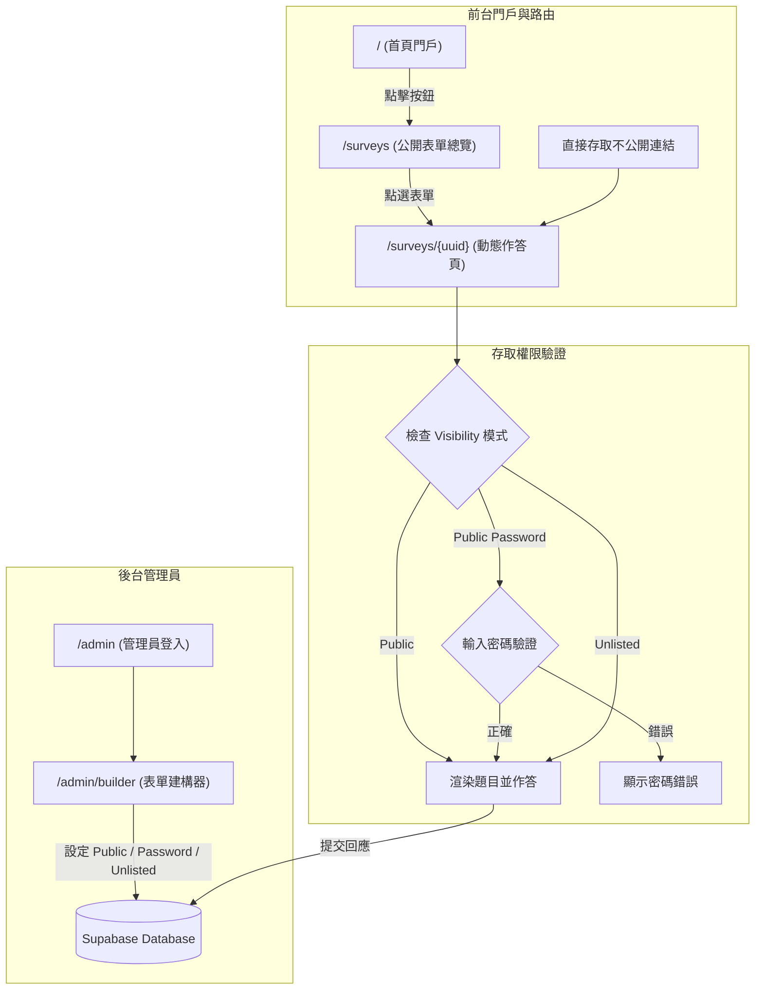

# 新竹縣第四屆兒童及少年諮詢代表官方網站 (Hsinchu County 4th Children and Youth Advisory Representatives Website)

[](LICENSE)
[](https://pages.cloudflare.com/)
[](https://supabase.com/)

本專案為**新竹縣第四屆兒童及少年諮詢代表（以下簡稱「竹縣少代」）**之官方門戶網站、議題徵求中心與**類 Google 表單之自訂表單管理系統**。網站旨在提供縣內兒少了解少代會運作機制與提案成果，並包含 `/surveys` 議題徵求中心與多重存取模式（公開、密碼存取、不公開連結）。

---

## 📌 專案定位與核心設計原則

1. **清晰的路由架構與議題徵求中心 (`/surveys`)**
   - **首頁專屬入口**：官方網站首頁設有醒目的「議題徵求 / 填寫表單」按鈕，一鍵引導至 `/surveys` 頁面。
   - **`/surveys` 公開表單總覽**：集中展示所有目前開放的公共議題表單。
   - **`/surveys/{uuid}` 動態表單頁**：每份表單均有獨一無二的 UUID 網址供兒少填寫。

2. **三種靈活的表單公開與存取權限**
   - 🌐 **公開 (Public)**：顯示於 `/surveys` 列表中，任何兒少均可自由填寫。
   - 🔑 **公開但需密碼 (Public with Password)**：顯示於 `/surveys` 列表中，但填寫前需輸入發布者設定的授權密碼。
   - 🔒 **不公開 / 僅限連結 (Unlisted)**：隱藏於 `/surveys` 列表，僅限擁有專屬連結 (`/surveys/{uuid}`) 的對象作答。

3. **直覺式自訂表單後台 (Google Forms-like Admin Builder)**
   - 後台提供拖拉式表單建構器，幹部可自由新增題型、設定存取模式（公開/密碼/不公開）與一鍵統計/匯出回應。

---

## 🗺️ 網站路由與頁面架構 (Routing & Page Structure)

```
┌───────────────────────────────────────────────────────────────────┐
│                          / (首頁 靜態門戶)                         │
│   • 介紹第四屆少代、組織架構、歷年提案                               │
│   • 醒目按鈕：[前往議題徵求中心 ➔] (導向 /surveys)                   │
└─────────────────────────────────┬─────────────────────────────────┘
                                  │
                                  ▼
┌───────────────────────────────────────────────────────────────────┐
│                      /surveys (議題徵求總覽頁)                     │
│   • 顯示所有 Visibility = 'public' 或 'public_password' 之開放表單 │
└─────────────────────────────────┬─────────────────────────────────┘
                                  │ 點擊特定表單卡片 或 透過直接連結
                                  ▼
┌───────────────────────────────────────────────────────────────────┐
│                     /surveys/{uuid} (表單作答頁)                   │
│   • 判斷權限：                                                    │
│     - Public: 直接顯示題目                                         │
│     - Public Password: 彈出密碼輸入框，核對無誤後解鎖題目          │
│     - Unlisted: 透過 UUID 直接進入並顯示題目                      │
└───────────────────────────────────────────────────────────────────┘
```

---

## 🏗️ 系統架構圖 (System Architecture)



---

## 🗄️ 動態表單資料庫模型設計 (Form Schema)

### 1. 表單結構主表 (`forms`)
增加 `visibility` (公開模式) 與 `access_password` (存取密碼) 欄位。

```sql
-- 建立權限模式列舉
CREATE TYPE form_visibility_enum AS ENUM ('public', 'public_password', 'unlisted');

CREATE TABLE public.forms (
    id UUID PRIMARY KEY DEFAULT gen_random_uuid(),
    title VARCHAR(255) NOT NULL,
    description TEXT,
    visibility form_visibility_enum DEFAULT 'public', -- 表單公開模式
    access_password VARCHAR(255),                     -- 密碼 (當 visibility = 'public_password')
    is_open BOOLEAN DEFAULT true,                     -- 是否開放填寫
    start_date TIMESTAMPTZ DEFAULT now(),
    end_date TIMESTAMPTZ,                             -- 截止日期
    fields JSONB NOT NULL DEFAULT '[]',               -- 動態題目欄位 (JSON)
    created_by UUID REFERENCES auth.users(id),
    created_at TIMESTAMPTZ DEFAULT now(),
    updated_at TIMESTAMPTZ DEFAULT now()
);

-- RLS 存取控制政策：
-- 1. /surveys 列表頁：僅能查詢 visibility 為 public 或 public_password，且 is_open = true 的表單
ALTER TABLE public.forms ENABLE ROW LEVEL SECURITY;

CREATE POLICY "Public list viewable forms" ON public.forms
    FOR SELECT USING (
        (visibility IN ('public', 'public_password') AND is_open = true)
        OR (visibility = 'unlisted' AND is_open = true) -- 允許透過 UUID 直接讀取單一表單
    );

CREATE POLICY "Admin full management" ON public.forms
    FOR ALL TO authenticated USING (true) WITH CHECK (true);
```

### 2. 表單回應紀錄表 (`form_submissions`)

```sql
CREATE TABLE public.form_submissions (
    id UUID PRIMARY KEY DEFAULT gen_random_uuid(),
    form_id UUID REFERENCES public.forms(id) ON DELETE CASCADE,
    answers JSONB NOT NULL,               -- 格式: {"field_id": "回答內容"}
    submitted_at TIMESTAMPTZ DEFAULT now()
);

ALTER TABLE public.form_submissions ENABLE ROW LEVEL SECURITY;

CREATE POLICY "Allow response submit" ON public.form_submissions
    FOR INSERT WITH CHECK (true);

CREATE POLICY "Admin view all responses" ON public.form_submissions
    FOR SELECT TO authenticated USING (true);
```

---

## 📁 專案目錄結構 (Directory Structure)

```
.
├── index.html              # 首頁 (包含醒目 [前往議題徵求 /surveys] 按鈕)
├── surveys.html            # /surveys - 公開表單總覽頁面
├── survey-detail.html      # /surveys/{uuid} - 支援 UUID 路由與密碼驗證之作答頁
├── about.html              # 關於第四屆少代
├── achievements.html       # 歷年提案與成果展示
├── admin/
│   ├── index.html          # 後台登入
│   ├── dashboard.html      # 後台表單列表與狀態切換
│   ├── builder.html        # 表單建構器 (設定 公開/密碼/不公開 模式)
│   └── responses.html      # 回應圖表與 CSV 匯出
├── css/
│   ├── main.css            # 核心視覺樣式
│   └── survey.css          # 表單與密碼鎖定介面樣式
├── js/
│   ├── config.js           # Supabase 設定
│   ├── surveys.js          # /surveys 頁面邏輯 (拉取公開與密碼表單)
│   ├── survey-detail.js    # /surveys/{uuid} 頁面邏輯 (UUID 解析與密碼比對)
│   └── builder.js          # 後台建構器邏輯
├── README.md               # 本專案架構說明
└── _redirects              # Cloudflare Pages 路由重定向規則 (/surveys/:id -> /survey-detail.html)
```

---

## 🚀 路由映射說明 (Cloudflare / SPA Routing)

為實現 `/surveys/{uuid}` 美觀網址，在 `_redirects` 設定如下規則：

```text
/surveys          /surveys.html         200
/surveys/*        /survey-detail.html   200
```

---

## 📄 授權條款 (License)

本專案採用 [MIT License](LICENSE) 授權開放。
