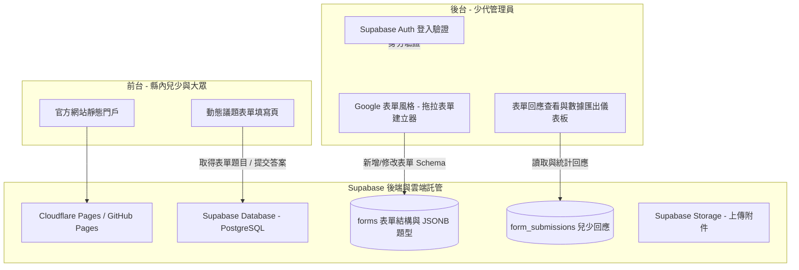

# 新竹縣第四屆兒童及少年諮詢代表官方網站 (Hsinchu County 4th Children and Youth Advisory Representatives Website)

[](LICENSE)
[](https://pages.cloudflare.com/)
[](https://supabase.com/)

本專案為**新竹縣第四屆兒童及少年諮詢代表（以下簡稱「竹縣少代」）**之官方門戶網站、議題徵求中心與**直覺式自訂表單管理系統**。網站旨在提供縣內兒少了解少代會運作機制與提案成果，同時配備類似 Google 表單體驗的後台管理介面，讓幹部能零程式碼快速建立各式議題徵求表單並管理回應。

---

## 📌 專案定位與核心設計原則

1. **極致簡單的自訂表單後台 (Google Forms-like Admin Builder)**
   - **拖拉與點擊式設計**：提供直覺的表單建構器，支援多種題型（單選、多選、簡答、長文、日期、檔案上傳等）。
   - **動態發布與開關**：一鍵切換議題徵求開放/關閉狀態，並可設定表單截止時間。
   - **回應統計與匯出**：後台提供直觀的數據統計圖表，並支援一鍵匯出 CSV / Excel 方便統計兒少意見。

2. **靜態門戶與低維護負擔 (Low Maintenance Portal)**
   - 官網主體（少代介紹、組織架構、歷年提案與常見問題）採靜態化設計，避免無謂的後端維運成本。

3. **個資安全與權限隔離 (Row Level Security)**
   - 使用 **Supabase Auth** 與 **Row Level Security (RLS)** 進行安全防護，嚴格限制只有通過身分驗證的少代管理員才能進入後台編輯表單與查看回應。

---

## 🏗️ 系統架構圖 (System Architecture)



---

## 🛠️ 技術選型 (Tech Stack)

| 架構層級 | 技術方案 | 說明 |
| :--- | :--- | :--- |
| **前台門戶與表單** | Vite + React / HTML5 + Vanilla JS | 輕量、快速載入，最佳化行動端與電腦端填寫體驗 |
| **後台管理介面** | React + TailwindCSS / Lucide Icons | 提供直覺順暢的 Google 表單風格 UI 與拖拉操作 |
| **後端與資料庫** | [Supabase](https://supabase.com/) (PostgreSQL) | 儲存動態表單 JSONB Schema、回應數據與權限控管 |
| **檔案儲存** | Supabase Storage | 存放兒少填寫表單時上傳的附件或證明文件 |
| **託管與部署** | [Cloudflare Pages](https://pages.cloudflare.com/) / GitHub Pages | 免費自動化 CDN 部署與自訂網域 |

---

## 🗄️ 動態表單資料庫模型設計 (Form Builder Schema)

為了達到像 Google 表單般靈活自訂題型的效果，資料庫設計採用 **JSONB Schema** 結構，實現零程式碼修訂題目的超高擴充性。

### 1. 表單結構主表 (`forms`)
紀錄表單標題、說明、狀態與所有題目欄位（JSONB 結構）。

```sql
CREATE TABLE public.forms (
    id UUID PRIMARY KEY DEFAULT gen_random_uuid(),
    title VARCHAR(255) NOT NULL,
    description TEXT,
    slug VARCHAR(100) UNIQUE,              -- 自訂網址代碼 (例如: /forms/youth-issue-2026)
    is_published BOOLEAN DEFAULT false,   -- 是否發布
    is_open BOOLEAN DEFAULT true,         -- 是否開放填寫
    start_date TIMESTAMPTZ DEFAULT now(),
    end_date TIMESTAMPTZ,                 -- 截止填寫時間
    fields JSONB NOT NULL DEFAULT '[]',   -- 關鍵：動態題目欄位定義 (格式見下方說明)
    theme_settings JSONB DEFAULT '{}',    -- 視覺主題 (背景色、標頭圖等)
    created_by UUID REFERENCES auth.users(id),
    created_at TIMESTAMPTZ DEFAULT now(),
    updated_at TIMESTAMPTZ DEFAULT now()
);

-- RLS 權限：
-- 1. 所有人可讀取已發布且開放中的表單
-- 2. 僅少代管理員 (Authenticated Admin) 可新增、修改、刪除表單
ALTER TABLE public.forms ENABLE ROW LEVEL SECURITY;

CREATE POLICY "Public read open forms" ON public.forms
    FOR SELECT USING (is_published = true AND is_open = true);

CREATE POLICY "Admin full access" ON public.forms
    FOR ALL TO authenticated USING (true) WITH CHECK (true);
```

#### 💡 `fields` (JSONB) 題目欄位結構範例：
後台建構器產生的題目 JSON 結構如下：
```json
[
  {
    "id": "field_101",
    "type": "single_choice",
    "label": "請選擇您的就讀階段",
    "placeholder": "",
    "required": true,
    "options": ["國小", "國中", "高中職", "大專院校", "其他"]
  },
  {
    "id": "field_102",
    "type": "multiple_choice",
    "label": "您最關心的兒少議題有哪些？（可複選）",
    "required": true,
    "options": ["教育與校園權益", "休閒娛樂與公共空間", "心理健康與輔導", "交通安全", "社會參與"]
  },
  {
    "id": "field_103",
    "type": "long_text",
    "label": "具體建議與意見說明",
    "placeholder": "請詳細說明您的想法與建議...",
    "required": false
  },
  {
    "id": "field_104",
    "type": "file_upload",
    "label": "佐證資料上傳（選填）",
    "required": false
  }
]
```

### 2. 表單回應紀錄表 (`form_submissions`)
儲存兒少填寫的回應內容。

```sql
CREATE TABLE public.form_submissions (
    id UUID PRIMARY KEY DEFAULT gen_random_uuid(),
    form_id UUID REFERENCES public.forms(id) ON DELETE CASCADE,
    answers JSONB NOT NULL,               -- 儲存格式: {"field_101": "高中職", "field_102": ["交通安全"]}
    respondent_ip VARCHAR(45),
    submitted_at TIMESTAMPTZ DEFAULT now()
);

-- RLS 權限：
-- 1. 所有人均可提交回應 (INSERT)
-- 2. 僅授權管理員 (Authenticated Admin) 可檢視與匯出回應 (SELECT)
ALTER TABLE public.form_submissions ENABLE ROW LEVEL SECURITY;

CREATE POLICY "Public submit responses" ON public.form_submissions
    FOR INSERT WITH CHECK (true);

CREATE POLICY "Admin view submissions" ON public.form_submissions
    FOR SELECT TO authenticated USING (true);
```

---

## 🎨 後台自訂表單流程 (Google Forms-like Workflow)

```
[ 幹部登入後台 ] 
      │
      ▼
[ 新增議題徵求表單 ] 
      │
      ├──> 設定表單名稱、說明與截止日期
      │
      ├──> 拖拉與增刪題目 (單選/多選/簡答/長答/檔案上傳)
      │
      ├──> 實時預覽填寫效果
      │
      └──> 一鍵點擊「發布表單」
            │
            ▼
[ 前台自動呈現於「公開表單區」供兒少填寫 ]
            │
            ▼
[ 後台檢視回應圖表 / 匯出 CSV 統計報告 ]
```

---

## 📁 專案目錄結構 (Directory Structure)

```
.
├── index.html              # 官方網站主頁 (門戶與簡介)
├── forms.html              # 前台：公開議題表單列表
├── form-view.html          # 前台：動態表單填寫頁面
├── admin/
│   ├── index.html          # 後台：管理員登入頁
│   ├── dashboard.html      # 後台：表單總覽儀表板與狀態開關
│   ├── builder.html        # 後台：Google 表單風格之拖拉表單建立器
│   └── responses.html      # 後台：回應統計數據與 CSV 匯出
├── css/
│   ├── main.css            # 全站核心視覺樣式
│   └── builder.css         # 表單編輯器與拖拉互動樣式
├── js/
│   ├── config.js           # Supabase 初始化與金鑰設定
│   ├── builder.js          # 後台表單建構器邏輯 (拖拉、題目增刪)
│   ├── form-render.js      # 前台根據 JSONB 自動渲染表單
│   └── admin.js            # 管理員身分驗證與數據統計邏輯
├── README.md               # 本專案架構與維護說明
└── .github/
    └── workflows/
        └── deploy.yml      # CI/CD 部署工作流
```

---

## 🚀 部署與營運指引 (Deployment Guide)

### 1. Supabase 專案設定
1. 建立新的 Supabase Project。
2. 進入 `SQL Editor` 執行本 README 中提供之 SQL 語法以創建表格與 RLS 權限。
3. 於 `Authentication` 新增少代管理員帳號。

### 2. 網站部署 (Cloudflare Pages)
1. 將本 Repository 連結至 **Cloudflare Pages**。
2. 在環境變數中設定 `VITE_SUPABASE_URL` 與 `VITE_SUPABASE_ANON_KEY`。
3. 部署完成後即可擁有自訂網址並啟用後台管理。

---

## 📄 授權條款 (License)

本專案採用 [MIT License](LICENSE) 授權開放。
