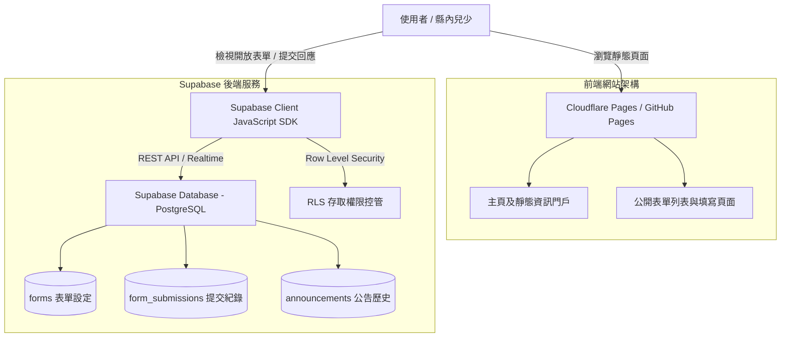

# 新竹縣第四屆兒童及少年諮詢代表官方網站 (Hsinchu County 4th Children and Youth Advisory Representatives Website)

[](LICENSE)
[](https://pages.cloudflare.com/)
[](https://supabase.com/)

本專案為**新竹縣第四屆兒童及少年諮詢代表（以下簡稱「竹縣少代」）**之官方門戶網站與公開表單中心。網站設計旨在提供縣內兒少與大眾了解少代會運作機制、成員簡介與提案成果，同時整合動態公開表單系統，便利表單發布與兒少意見蒐集。

---

## 📌 專案定位與核心設計原則

1. **靜態門戶與極低維護負擔 (Low Maintenance Cost)**
   - 官方網站主體內容（少代介紹、組織架構、法規規範、歷年提案與常見問題）採靜態化設計。
   - 資訊一次性佈署後無需頻繁修改程式碼，減輕幹部與後續維護人員的維運成本。

2. **動態表單中心 (Dynamic Open Forms)**
   - 結合 **Supabase** 開放式資料庫服務，表單列表與填寫狀態由資料庫動態驅動。
   - 可隨時透過 Supabase 後台新增、關閉或管理公開表單，無需重新發布網站。

3. **極致效能與安全性 (Performance & Security)**
   - 前端採用輕量化靜態架構，無龐大伺服器成本。
   - 全站資料寫入均通過 Supabase **Row Level Security (RLS)** 政策控管，保障個資安全。

---

## 🏗️ 系統架構圖 (System Architecture)



---

## 🛠️ 技術選型 (Tech Stack)

| 架構層級 | 技術方案 | 說明 |
| :--- | :--- | :--- |
| **前端門戶** | HTML5 / Vanilla CSS / Modern JS (ES6+) 或 Vite | 零負擔靜態載入，優異的 SEO 與瀏覽體驗 |
| **後端與資料庫** | [Supabase](https://supabase.com/) (PostgreSQL) | 提供即時 API、身份驗證、資料庫存取及 RLS 安全控管 |
| **託管與部署** | [Cloudflare Pages](https://pages.cloudflare.com/) / GitHub Pages | 自動化 CI/CD、免費 HTTPS 與全球 Edge CDN 加速 |
| **圖示與樣式** | Remix Icon / Google Fonts (Inter, Outfit) | 現代化視覺設計與無障礙網頁體驗 |

---

## 🗄️ 資料庫模型設計 (Supabase Database Schema)

以下為 Supabase PostgreSQL 之表結構設計：

### 1. 表單主表 (`forms`)
用於管理前台顯示的公開表單資訊。

```sql
CREATE TABLE public.forms (
    id UUID PRIMARY KEY DEFAULT gen_random_uuid(),
    title VARCHAR(255) NOT NULL,
    description TEXT,
    form_url TEXT, -- 外部表單連結 (如 Google Forms) 或內建表單代碼
    is_open BOOLEAN DEFAULT true,
    start_date TIMESTAMPTZ DEFAULT now(),
    end_date TIMESTAMPTZ,
    created_at TIMESTAMPTZ DEFAULT now()
);

-- RLS 權限：允許所有人讀取已開放的表單
ALTER TABLE public.forms ENABLE ROW LEVEL SECURITY;
CREATE POLICY "Allow public read for active forms" ON public.forms
    FOR SELECT USING (is_open = true);
```

### 2. 表單提交紀錄表 (`form_submissions`)
若使用內建表單時，收集兒少填寫的回應。

```sql
CREATE TABLE public.form_submissions (
    id UUID PRIMARY KEY DEFAULT gen_random_uuid(),
    form_id UUID REFERENCES public.forms(id) ON DELETE CASCADE,
    respondent_name VARCHAR(100),
    contact_email VARCHAR(255),
    answers JSONB NOT NULL, -- 彈性儲存問答內容
    submitted_at TIMESTAMPTZ DEFAULT now()
);

-- RLS 權限：僅允許公眾新增 (INSERT)，不開放公開讀取 (SELECT)
ALTER TABLE public.form_submissions ENABLE ROW LEVEL SECURITY;
CREATE POLICY "Allow public insert" ON public.form_submissions
    FOR INSERT WITH CHECK (true);
```

### 3. 少代成員資料表 (`representatives`) — 可選靜態/動態管理
用於展示第四屆成員簡介與小組分工。

```sql
CREATE TABLE public.representatives (
    id UUID PRIMARY KEY DEFAULT gen_random_uuid(),
    name VARCHAR(100) NOT NULL,
    group_name VARCHAR(100), -- 如：教育文化組、社會權益組
    role VARCHAR(100),       -- 如：召集人、副召集人、代表
    avatar_url TEXT,
    bio TEXT,
    order_index INT DEFAULT 0
);

ALTER TABLE public.representatives ENABLE ROW LEVEL SECURITY;
CREATE POLICY "Allow public read" ON public.representatives
    FOR SELECT USING (true);
```

---

## 📁 專案目錄結構 (Directory Structure)

```
.
├── index.html              # 官方網站主頁 (門戶與簡介)
├── forms.html              # 公開表單列表與動態中心
├── about.html              # 關於第四屆少代、組織與組織章程
├── achievements.html       # 歷年提案與成果展示
├── css/
│   ├── main.css            # 全站核心樣式與變數定義
│   └── components.css      # 卡片、按鈕、表單等元件樣式
├── js/
│   ├── config.js           # Supabase 初始化設定 (URL & Anon Key)
│   ├── forms.js            # 表單動態拉取與狀態判斷邏輯
│   └── main.js             # 動態 UI 互動與導覽列邏輯
├── assets/
│   ├── images/             # 網站靜態圖片、Logo 與代表照片
│   └── icons/              # 圖示資源
├── README.md               # 本專案架構與維護說明
└── .github/
    └── workflows/
        └── deploy.yml      # GitHub Actions / Cloudflare 部署工作流
```

---

## 🚀 部署與營運指引 (Deployment Guide)

### 選擇 1：Cloudflare Pages 部署 (推薦)
1. 將此儲存庫連接至 **Cloudflare Dashboard** -> **Pages**。
2. 設定 Build Settings：
   - **Build Command**: （若為純靜態可留空，或使用 `npm run build`）
   - **Build Output Directory**: `./` 或 `dist`
3. 於 Cloudflare Pages 設定環境變數：
   - `SUPABASE_URL`: 您的 Supabase 專案網址
   - `SUPABASE_ANON_KEY`: 您的 Supabase 匿名存取 Key

### 選擇 2：GitHub Pages 部署
1. 開啟 GitHub 儲存庫設定 `Settings` -> `Pages`。
2. Source 選擇 `Deploy from a branch`。
3. Branch 選擇 `main` / Root (`/`)。
4. 儲存後即可自動完成部署。

---

## 🔒 隱私與安全說明

- 本專案絕不公開任何填寫表單個資。
- Supabase 後台僅供授權之管理者登入，前台僅透過 `ANON_KEY` 進行權限受限之操作。

---

## 📄 授權條款 (License)

本專案採用 [MIT License](LICENSE) 授權開放。
